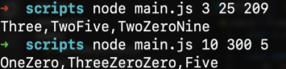

# NumToString

This javascript program is responsible for converting integer arguments into words with respect to each digit given. The script file for this program can be found in main.js

## Example Runs

Given an array: [3, 25, 209], the program will output “Three,TwoFive,TwoZeroNine” into stdout.

Given an array: [10, 300, 5], the program will output “OneZero,ThreeZeroZero,Five” into stdout.

Note: The program will output error message for invalid enteries such as negative values or Non integer arguments such as Strings and special characters.

## Author

GITHUB: https://github.com/Meerxn
portfolio: https://meerxn.github.io/MyPersonalCV/